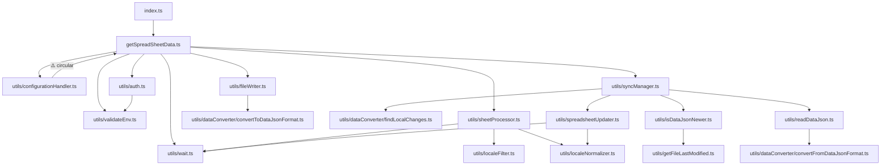

> **Status as of v2.0.0:** All 🔴 Critical and 🟠 High items are resolved. All 🟡 Medium items are resolved. Most 🟢 Low items are resolved. See §10 below for the updated status of each TODO item.

# Package Audit: `@el-j/google-sheet-translations`

## 1. Executive Summary

`@el-j/google-sheet-translations` is a TypeScript Node.js package that fetches translation data from Google Sheets and writes locale files for use in web applications. The codebase is well-structured with clear module separation, good JSDoc coverage, and an impressive test suite (130 tests, 96.4% statement coverage). However, several issues undermine production readiness: a confirmed circular import between `configurationHandler` and `getSpreadSheetData`, a path-traversal vulnerability in `fileWriter.ts`, unsafe type assertions on externally-sourced data, out-of-bounds column letter generation in spreadsheet formula building, an over-broad public API surface that exposes internal utilities, and complete absence of a linter or formatter configuration. The recursive refresh strategy in `getSpreadSheetData` could cause infinite recursion under edge-case race conditions.

**Overall quality rating: 6.5 / 10**

Key findings: (1) path traversal on locale filenames, (2) circular dependency, (3) Google Sheets column index can exceed `Z` producing corrupt formulas, (4) `tsconfig.test.json` disables `strict`/`noImplicitAny`/`strictNullChecks`, (5) dead variable `localeKey` and redundant null-checks indicate gaps in compiler enforcement.

---

## 2. Architecture Overview



**Narrative:** The package has a clean layered design: the top-level entry point (`getSpreadSheetData`) orchestrates authentication, sheet processing, sync management, and file writing. Utilities are grouped under `src/utils/` with a `dataConverter/` sub-namespace. The single design flaw is `configurationHandler.ts` importing `DEFAULT_WAIT_SECONDS` from the module it is consumed by, creating a circular dependency that TypeScript and CommonJS resolve only by coincidence of evaluation order.

---

## 3. Type Safety

| File | Issue | Severity | Recommendation |
|------|-------|----------|----------------|
| `src/utils/validateEnv.ts:27-29` | `process.env[varName] as string` — type assertion is correct after the guard, but the guard uses a falsy check (`!process.env[varName]`) which would also throw on an empty-string value, yet the assertion still widens | Medium | Use `process.env[varName]!` (non-null assertion) to communicate intent; add an `if (value === '')` check if empty strings should also be invalid |
| `src/utils/dataConverter/convertFromDataJsonFormat.ts:16` | `projectData[sheetTitle] as Record<string, Record<string, TranslationValue>>` — casts arbitrary parsed JSON without schema validation | High | Introduce a type-guard or use `zod`/`valibot` to parse the shape before casting |
| `src/utils/spreadsheetUpdater.ts:113,141` | `localeData[key] as string` — `localeData` is typed `Record<string, TranslationValue>` so the cast discards `number \| boolean \| Record<…> \| unknown[]` | High | Coerce explicitly: `String(localeData[key])` or narrow the type to `string` in the caller |
| `src/utils/spreadsheetUpdater.ts:126` | `existingKeys.get(keyLower) as number` — `.get()` returns `number \| undefined`; the guard `existingKeys.has(keyLower)` is present but the assertion is still unsafe if the Map is mutated concurrently | Low | Use the non-null assertion `existingKeys.get(keyLower)!` for clarity, or destructure with a definite check |
| `src/utils/localeNormalizer.ts:87` | `createLocaleMapping` has no explicit return type annotation | Low | Add `: { normalizedLocales: string[]; localeMapping: Record<string, string>; originalMapping: Record<string, string> }` |
| `src/utils/localeNormalizer.ts:53-56` | `normalizeLocaleCode` declares return type `string` but if `locale` is falsy it returns the falsy value as-is (e.g. `return locale` on an empty string); at runtime this is fine, but the guard `if (!locale …)` should return `''` to stay honest | Low | Change `return locale;` to `return '';` in the early-return guard |
| `tsconfig.test.json:4-7` | `"strict": false`, `"noImplicitAny": false`, `"strictNullChecks": false` — tests compile under weaker rules than production code; bugs masked by assertions like `as any` in test files are invisible to the compiler | High | Remove the overrides from `tsconfig.test.json` so tests compile under identical strictness |
| `src/utils/isDataJsonNewer.ts:29` | `(mostRecentTranslationMtime as Date).getTime()` — the `.filter(Boolean)` above does not narrow `Date \| null` to `Date` in TypeScript | Medium | Replace `.filter(Boolean)` with `.filter((d): d is Date => d !== null)` |

---

## 4. Error Handling

| File | Issue | Severity | Recommendation |
|------|-------|----------|----------------|
| `src/getSpreadSheetData.ts:34` | `await doc.loadInfo(true)` — uncaught; any network failure (auth error, quota exceeded) throws an untyped error to the caller with no context | High | Wrap in try/catch and rethrow with a descriptive `Error`: `throw new Error(\`Failed to load spreadsheet ${GOOGLE_SPREADSHEET_ID}: ${(e as Error).message}\`)` |
| `src/getSpreadSheetData.ts:59` | `Promise.all(docTitle.map(…))` — each iteration's error is caught inside `processSheet` (success=false), but if `processSheet` itself throws outside the try/catch (e.g., `.toObject()` before line 121) it will reject the `Promise.all` entirely | Medium | Move the entire `processSheet` invocation body inside `try/catch`, or let `getSpreadSheetData` catch the outer `Promise.all` |
| `src/utils/sheetProcessor.ts:121-123` | Error is caught and logged but `result.success` stays `false`; the caller in `getSpreadSheetData` silently skips failed sheets with no aggregated error reporting | Medium | Append failed sheet names to an errors array; after all sheets are processed, log a summary or throw if zero sheets succeeded |
| `src/utils/spreadsheetUpdater.ts:143` | `await row.save()` inside a loop with no try/catch; a single rate-limit or network error aborts all remaining updates | High | Wrap in try/catch per row; log the failure and continue, or implement exponential back-off |
| `src/utils/syncManager.ts:76` | `await updateSpreadsheetWithLocalChanges(…)` has no try/catch; a failure here sets `shouldRefresh = true` only if the call succeeds, but on throw the entire `handleBidirectionalSync` rejects, propagating to `getSpreadSheetData` without cleanup | High | Wrap in try/catch; on error, log and return `{ shouldRefresh: false, hasChanges: false }` |
| `src/utils/fileWriter.ts:29,76,102` | `fs.writeFileSync` and `fs.mkdirSync` are unguarded; EACCES/ENOSPC throw synchronously and silently break the operation | Medium | Wrap each `writeFileSync`/`mkdirSync` in try/catch; provide actionable error messages including the target path |
| `src/utils/readDataJson.ts:21-23` | `JSON.parse` failure is caught and returns `null`; the caller cannot distinguish "file missing" from "file corrupt", leading to silent data loss | Medium | Return a discriminated union: `{ ok: true; data: TranslationData } \| { ok: false; reason: 'missing' \| 'parse_error'; error?: unknown }` |
| `src/utils/getFileLastModified.ts:12` | `catch (error)` swallows the error entirely and returns `null`; any `fs.statSync` failure (including EPERM) is invisible | Low | Log a warning with the file path and error message before returning `null` |

---

## 5. Security

| Finding | File | Line (approx.) | Severity | Recommendation |
|---------|------|----------------|----------|----------------|
| **Path traversal via locale filename** | `src/utils/fileWriter.ts` | 30 | 🔴 Critical | `locale.toLowerCase()` is derived from spreadsheet column headers. A header value of `../../../etc/cron.d/backdoor` would write to an arbitrary path. Sanitize: `const safeName = locale.toLowerCase().replace(/[^a-z0-9_-]/g, '_');` before constructing the path |
| **Column letter overflow in formula injection** | `src/utils/spreadsheetUpdater.ts` | 187–198 | 🔴 Critical | `String.fromCharCode(65 + sourceHeaderIndex)` produces non-alpha characters (e.g. `[`, `\`) when a sheet has more than 26 columns. This corrupts formulas but also could be abused if a malicious column header is crafted. Guard: `if (sourceHeaderIndex > 25 \|\| targetHeaderIndex > 25) { continue; }` and add multi-letter column support |
| **Sensitive translation data logged to console** | `src/utils/syncManager.ts` | 73 | 🟠 High | `console.log(JSON.stringify(changes, null, 2))` dumps all pending translation changes including potentially sensitive strings (user-facing copy, internal keys) to stdout. Replace with `console.log(\`Found ${Object.keys(changes).length} locales with local changes to sync\`)` |
| **Private key in process.env accessible throughout runtime** | `src/utils/auth.ts` / `src/utils/validateEnv.ts` | 9, 26-28 | 🟠 High | `GOOGLE_PRIVATE_KEY` stays alive in `process.env` for the entire process lifetime. After constructing the JWT client, consider `delete process.env.GOOGLE_PRIVATE_KEY` to limit the exposure window (note: this is a defence-in-depth measure, not a complete fix) |
| **Arbitrary JSON deserialization without schema validation** | `src/utils/readDataJson.ts` | 17–20 | 🟠 High | `JSON.parse(dataJsonContent)` feeds untrusted file content directly into `convertFromDataJsonFormat` which immediately casts it. A malformed or maliciously crafted `languageData.json` can cause unexpected runtime behaviour. Add a structural check before casting |
| **`localesOutputPath` allows writing arbitrary `.ts` files** | `src/utils/configurationHandler.ts` / `src/utils/fileWriter.ts` | 38, 76 | 🟡 Medium | The `localesOutputPath` option accepts a caller-controlled path; combined with the auto-generated content template, this could be used to overwrite production source files. Validate that the resolved path is within the project directory |
| **`autoTranslate` inserts spreadsheet formulas using header values** | `src/utils/spreadsheetUpdater.ts` | 198 | 🟡 Medium | The target column letter is computed from a spreadsheet-controlled header index. A sheet with unusually ordered headers could produce syntactically valid but semantically wrong `GOOGLETRANSLATE` formulas referencing unintended cells |

---

## 6. Performance

| Finding | File | Severity | Recommendation |
|---------|------|----------|----------------|
| **Double `wait()` per sheet** | `src/getSpreadSheetData.ts:61` + `src/utils/sheetProcessor.ts:119` | Medium | Each sheet already waits *after* processing inside `processSheet`; `getSpreadSheetData` also waits *before* calling it. One of the two `wait()` calls is redundant. Remove the pre-call `wait` in `getSpreadSheetData` and keep only the post-processing one in `processSheet` |
| **Recursive full-refresh on sync** | `src/getSpreadSheetData.ts:129` | High | After a successful sync-to-sheet, `getSpreadSheetData` calls itself recursively, reloading all sheets, re-authenticating, and re-writing all files. Instead, track the merged/updated data in memory and skip the refresh, or at minimum pass `_docTitle` to avoid re-inferring sheet list |
| **`rows.map(row => row.toObject())` materialises all rows eagerly** | `src/utils/sheetProcessor.ts:70` | Low | All rows are converted to plain objects before iteration even if many will be discarded. Use a lazy generator or process rows directly in the loop |
| **Linear scan to find max mtime** | `src/utils/isDataJsonNewer.ts:24-27` | Low | Sorts the entire mtime array just to retrieve the maximum. Replace with: `const max = files.reduce((m, f) => { const t = getFileLastModified(f); return t && t > m ? t : m; }, new Date(0));` — O(n) without sort |
| **`row.toObject()` called twice for existing-key update** | `src/utils/spreadsheetUpdater.ts:67–74,134` | Low | `row.toObject()` is called once to build `existingKeys` (line 69) and again inside the fallback header lookup (line 134). Cache the result from the initial iteration |
| **`Object.assign({}, ...nonEmptyLanguageCells)` spread on large arrays** | `src/utils/sheetProcessor.ts:106` | Low | Spreading a large array into `Object.assign` hits JS engine argument-count limits and is slower than a `reduce`. Use `nonEmptyLanguageCells.reduce((acc, cell) => Object.assign(acc, cell), {})` |
| **`convertToDataJsonFormat` nested triple loop** | `src/utils/dataConverter/convertToDataJsonFormat.ts:29-64` | Low | O(sheets × locales × keys) but re-iterates `Object.keys(translationObj)` to collect `allSheets` before iteration. Combine the collection and output phases into a single pass |

---

## 7. Test Coverage

### Overall Stats (from Istanbul HTML report)

| Metric | Coverage | Raw |
|--------|----------|-----|
| Statements | **96.38%** | 453/470 |
| Branches | **87.56%** | 169/193 |
| Functions | **86.76%** | 59/68 |
| Lines | **97.24%** | 424/436 |

### Per-File Breakdown (notable gaps)

| File | Stmts | Branches | Functions | Lines |
|------|-------|----------|-----------|-------|
| `index.ts` | 100% | 100% | **52.94%** | 100% |
| `localeNormalizer.ts` | 95.34% | 95.83% | **75%** | 97.56% |
| `sheetProcessor.ts` | 86.53% | **78.94%** | 100% | 87.75% |
| `spreadsheetUpdater.ts` | 95.78% | **76.08%** | 100% | 96.62% |
| `syncManager.ts` | 91.66% | 83.33% | 100% | 91.66% |
| `dataConverter/` (combined) | 96.36% | **78.26%** | 100% | 100% |

### Specific Gaps

1. **`getNormalizedLocaleForHeader`** (`localeNormalizer.ts`) — 0% function coverage; the function is exported but never tested. It is also unused within the package itself (dead export).
2. **`syncManager.ts` "no changes" branch** (line 67–70) — `console.log("No local changes found…"); return result;` is never exercised. Test: provide `localData` and `spreadsheetData` with identical contents.
3. **`spreadsheetUpdater.ts` — multiple uncovered branches**: the `!changes[locale]?.[sheetTitle]` continue (line 85), the `!theKey` defensive warn (line 108–111), the `i + CHUNK_SIZE < newRows.length` inter-chunk wait (line 216–218). The last is practically unreachable with test data having fewer than 5 rows.
4. **`sheetProcessor.ts` — `cells.length === 0` guard (line 72)** — covered in neither the unit tests nor integration tests; `rows.map()` always returns an array.
5. **`index.ts` function coverage 52.94%** — re-exported utility functions (`createAuthClient`, `validateEnv`, `wait`, converters) are never called through the barrel re-export in tests; tests import directly from source modules.

### Structural Test Issues

- **Duplicate test files**: `tests/basic.test.js` + `tests/basic.test.ts` and `tests/utils/convertToDataJsonFormat.test.ts` + `tests/utils/dataConverter/convertToDataJsonFormat.test.ts` — the duplicates add noise and may shadow failures.
- **`tsconfig.test.json` disables `strict`, `noImplicitAny`, `strictNullChecks`** — test code compiles under looser rules than production; unsafe mock patterns (e.g., `as any`) are unchecked by the compiler.
- **No integration/e2e tests** against a real or stubbed Google Sheets API; all external calls are mocked at the module level.

### Recommendations

- Add a branch coverage threshold of ≥ 90% to `jest.config.js` via `coverageThreshold`.
- Write a test for `getNormalizedLocaleForHeader` or remove the export.
- Fix `tsconfig.test.json` to inherit strict settings.
- Remove duplicate test files.

---

## 8. API Surface & Public Exports

### What is Exported (`src/index.ts`)

| Export | Type | Assessment |
|--------|------|------------|
| `getSpreadSheetData` | function (named + default) | ✅ Should be public |
| `DEFAULT_WAIT_SECONDS` | constant | 🟡 Questionable — trivial internal constant; can break semver if changed |
| `normalizeConfig` | function | 🔴 Should be internal — consumers have no use for it |
| `SpreadsheetOptions` | type | ✅ Should be public (input type for `getSpreadSheetData`) |
| `NormalizedConfig` | type | 🟡 Questionable — internal implementation detail |
| `processSheet` | function | 🔴 Should be internal |
| `SheetProcessingResult` | type | 🔴 Should be internal |
| `handleBidirectionalSync` | function | 🔴 Should be internal |
| `SyncResult` | type | 🔴 Should be internal |
| `writeTranslationFiles`, `writeLocalesFile`, `writeLanguageDataFile` | functions | 🟡 Marginal — useful for advanced consumers but break the abstraction |
| `isValidLocale`, `filterValidLocales` | functions | 🟡 Useful standalone utilities; acceptable to keep |
| `wait` | function | 🔴 Pure implementation detail — should not be public |
| `validateEnv` | function | 🔴 Should be internal |
| `createAuthClient` | function | 🔴 Should be internal; exposes credential-loading logic |
| `convertToDataJsonFormat`, `convertFromDataJsonFormat`, `findLocalChanges` | functions | 🔴 Internal data-pipeline details; exposes internal format |
| `updateSpreadsheetWithLocalChanges` | function | 🔴 Should be internal |
| `TranslationData`, `TranslationValue`, `SheetRow`, `GoogleEnvVars` | types | ✅ Public types are fine |

### Versioning Concerns

- **Version is `1.0.0`** but the API surface is not stable — internal functions are public, making non-breaking refactors impossible without a major version bump.
- **Dual default + named export** for `getSpreadSheetData` (`index.ts` and `getSpreadSheetData.ts` both do `export default`) is redundant and creates confusion for consumers.
- **No `exports` field** in `package.json` — the entire `dist/` tree is accessible as deep imports, bypassing the intended public surface.

### Recommendation

Add an `exports` field to `package.json`:

```json
"exports": {
  ".": {
    "require": "./dist/index.js",
    "types": "./dist/index.d.ts"
  }
}
```

And reduce the public API to:

```typescript
export { getSpreadSheetData } from './getSpreadSheetData';
export type { SpreadsheetOptions, TranslationData, TranslationValue, SheetRow } from './...';
export default getSpreadSheetData;
```

---

## 9. Code Quality & Maintainability

### Dead Code

- **`convertToDataJsonFormat.ts:39`** — `const localeKey = locale.toLowerCase();` is declared but never referenced. The surrounding code uses `locale` directly.
  ```typescript
  // Line 39 — remove this line entirely
  const localeKey = locale.toLowerCase(); // ← never used
  ```

- **`localeNormalizer.ts:155-159`** — `getNormalizedLocaleForHeader` is exported but called nowhere in the package, and its test coverage is 0%.

### Redundant Null Checks

- **`getSpreadSheetData.ts:37–39`**:
  ```typescript
  let docTitle: string[] = _docTitle || [];    // line 37: docTitle is always an array
  if (!docTitle || docTitle.length === 0) {    // line 39: !docTitle is always false
  ```
  The `|| []` on line 37 guarantees `docTitle` is truthy; the `!docTitle` check on line 39 is dead.

- **`sheetProcessor.ts:72-74`**:
  ```typescript
  const cells = rows.map(row => row.toObject()); // .map() never returns null/undefined
  if (!cells || cells.length === 0) {            // !cells is always false
  ```

### Circular Dependency

- **`src/utils/configurationHandler.ts:2`** imports `DEFAULT_WAIT_SECONDS` from `../getSpreadSheetData`
- **`src/getSpreadSheetData.ts:6`** imports `normalizeConfig` from `./utils/configurationHandler`

This is a textbook circular dependency. Node.js's CommonJS loader resolves it only because `DEFAULT_WAIT_SECONDS` is a plain `const` that gets initialised before the circular reference is evaluated. Move the constant to a dedicated file (e.g., `src/constants.ts`) to eliminate the risk:

```typescript
// src/constants.ts
export const DEFAULT_WAIT_SECONDS = 1;
```

### Inconsistent Indentation

- All source files use **tabs** for indentation except `src/utils/spreadsheetUpdater.ts`, which uses **4 spaces**. A Prettier config would enforce consistency.

### Mismatched Comment

- **`localeFilter.ts:49`**: Comment says `// Use original case for validation` but `column` at this point is already lowercased by `Object.keys(rowObject).map(key => key.toLowerCase())` in `sheetProcessor.ts:50`. The comment is misleading.

### Overlapping Validation Logic

- `localeFilter.ts` defines `COMMON_LOCALE_PATTERNS` (4 regexes) and `NON_LOCALE_KEYWORDS` (16 strings) to detect locale columns.
- `localeNormalizer.ts:101` defines its own locale regex: `/^[a-z]{2}([_-][a-z]{2})?([_-][a-z]+)?$/`

These two validation approaches are inconsistent (e.g., `localeFilter.ts` would reject a `zh-cn-traditional` format, while `localeNormalizer.ts` accepts it). Centralise locale validation in one place.

### Complexity

- `spreadsheetUpdater.ts` is 226 lines and handles sheet detection, key diffing, auto-translation formula generation, and chunked row insertion. Extract each responsibility into a named helper function.

---

## 10. Comprehensive TODO List

### 🔴 Critical (security / data-loss / bugs)

1. **[`src/utils/fileWriter.ts:30`] Path traversal via locale filename**
   Sanitise locale before using it as a filename component:
   ```typescript
   // Before:
   `${translationsOutputDir}/${locale.toLowerCase()}.json`
   // After:
   const safeName = locale.toLowerCase().replace(/[^a-z0-9_-]/g, '_');
   if (safeName !== locale.toLowerCase()) {
     console.warn(`Locale "${locale}" contained unsafe characters; sanitised to "${safeName}"`);
   }
   `${translationsOutputDir}/${safeName}.json`
   ```

2. **[`src/utils/spreadsheetUpdater.ts:187–191`] Column letter overflow produces corrupt / injected formulas for sheets with >26 columns**
   Add a bounds check before building the formula:
   ```typescript
   if (sourceHeaderIndex < 0 || sourceHeaderIndex > 25 ||
       targetHeaderIndex < 0 || targetHeaderIndex > 25) {
     console.warn(`Sheet has >26 columns; skipping auto-translate for "${exactHeaderName}"`);
     continue;
   }
   ```

3. **[`src/utils/configurationHandler.ts:2` ↔ `src/getSpreadSheetData.ts:6`] Circular dependency**
   Create `src/constants.ts`:
   ```typescript
   export const DEFAULT_WAIT_SECONDS = 1;
   ```
   Update `configurationHandler.ts` and `getSpreadSheetData.ts` to import from `./constants`.

4. **[`src/utils/syncManager.ts:76`] Unhandled promise rejection in sync path**
   ```typescript
   try {
     await updateSpreadsheetWithLocalChanges(doc, changes, waitSeconds, autoTranslate, localeMapping);
     result.shouldRefresh = true;
     result.hasChanges = true;
   } catch (err) {
     console.error("Failed to sync local changes to spreadsheet:", err);
     // Do not set shouldRefresh; return unchanged result
   }
   ```

5. **[`src/utils/spreadsheetUpdater.ts:143`] `row.save()` can throw on rate-limit; aborts all remaining updates**
   ```typescript
   try {
     await row.save();
   } catch (err) {
     console.error(`Failed to save row for key "${keyLower}" in sheet "${sheetTitle}":`, err);
   }
   ```

---

### 🟠 High (type safety / error handling)

6. **[`tsconfig.test.json:4-7`] Tests compile under weaker strict settings than production**
   Remove the three overrides:
   ```json
   // Remove these lines from tsconfig.test.json:
   "noImplicitAny": false,
   "strictNullChecks": false,
   "strict": false
   ```

7. **[`src/utils/dataConverter/convertFromDataJsonFormat.ts:16`] Unsafe cast on external JSON**
   Add a structural guard:
   ```typescript
   function isSheetData(v: unknown): v is Record<string, Record<string, TranslationValue>> {
     return typeof v === 'object' && v !== null;
   }
   const sheetData = projectData[sheetTitle];
   if (!isSheetData(sheetData)) continue;
   ```

8. **[`src/utils/spreadsheetUpdater.ts:113,141`] `as string` cast on `TranslationValue`**
   ```typescript
   // Before:
   theKey[localeHeader] = value;            // value is TranslationValue
   row.set(localeHeader, localeData[key] as string);
   // After:
   theKey[localeHeader] = String(value);
   row.set(localeHeader, String(localeData[key]));
   ```

9. **[`src/getSpreadSheetData.ts:34`] `doc.loadInfo()` network call has no error handler**
   ```typescript
   try {
     await doc.loadInfo(true);
   } catch (err) {
     throw new Error(`Failed to load spreadsheet "${GOOGLE_SPREADSHEET_ID}": ${(err as Error).message}`);
   }
   ```

10. **[`src/utils/isDataJsonNewer.ts:27–29`] `.filter(Boolean)` does not narrow `Date | null` to `Date`**
    ```typescript
    .filter((d): d is Date => d !== null)
    .reduce<Date | null>((max, d) => (max === null || d > max ? d : max), null);
    ```

11. **[`src/utils/syncManager.ts:73`] Sensitive translation data logged in full**
    ```typescript
    // Before:
    console.log("Found local changes to sync to the spreadsheet:");
    console.log(JSON.stringify(changes, null, 2));
    // After:
    const localesCount = Object.keys(changes).length;
    const keysCount = Object.values(changes).flatMap(l => Object.values(l)).flatMap(s => Object.keys(s)).length;
    console.log(`Found local changes: ${localesCount} locale(s), ~${keysCount} key(s) to sync`);
    ```

---

### 🟡 Medium (performance / maintainability)

12. **[`src/getSpreadSheetData.ts:37,39`] Redundant null checks on `docTitle`**
    ```typescript
    // Before:
    let docTitle: string[] = _docTitle || [];
    if (!docTitle || docTitle.length === 0) {
    // After:
    const docTitle: string[] = _docTitle ?? [];
    if (docTitle.length === 0) {
    ```

13. **[`src/utils/sheetProcessor.ts:72-74`] Dead null check on `.map()` result**
    ```typescript
    // Remove this guard entirely — Array.prototype.map never returns null
    if (!cells || cells.length === 0) { ... }
    ```

14. **[`src/utils/dataConverter/convertToDataJsonFormat.ts:39`] Dead variable `localeKey`**
    ```typescript
    // Remove line 39:
    const localeKey = locale.toLowerCase(); // ← DEAD, never used
    ```

15. **[`src/getSpreadSheetData.ts:129`] Recursive full-refresh is expensive**
    Pass the already-loaded data from `updateSpreadsheetWithLocalChanges` instead of re-fetching all sheets. At minimum, add a depth guard:
    ```typescript
    const MAX_REFRESH_DEPTH = 1;
    export async function getSpreadSheetData(
      _docTitle?: string[],
      options: SpreadsheetOptions = {},
      _refreshDepth = 0,
    ): Promise<TranslationData> {
      ...
      if (syncResult.shouldRefresh && _refreshDepth < MAX_REFRESH_DEPTH) {
        return getSpreadSheetData(_docTitle, { ...options, syncLocalChanges: false }, _refreshDepth + 1);
      }
    ```

16. **[`src/utils/isDataJsonNewer.ts:24-27`] Sort to find max — use reduce instead**
    ```typescript
    const mostRecent = files
      .map(file => getFileLastModified(file))
      .filter((d): d is Date => d !== null)
      .reduce<Date | null>((max, d) => (max === null || d > max ? d : max), null);
    if (!mostRecent) return true;
    return dataJsonMtime > mostRecent;
    ```

17. **[`src/utils/sheetProcessor.ts:106`] `Object.assign({}, ...spread)` on potentially large arrays**
    ```typescript
    // Before:
    prepareObj[sheetTitle] = Object.assign({}, ...nonEmptyLanguageCells);
    // After:
    prepareObj[sheetTitle] = nonEmptyLanguageCells.reduce(
      (acc, cell) => Object.assign(acc, cell), {} as Record<string, string>
    );
    ```

18. **[`src/utils/localeFilter.ts` / `src/utils/localeNormalizer.ts`] Duplicate/inconsistent locale validation regexes**
    Consolidate into a single `src/utils/localeValidation.ts` module that both files import from.

19. **[`src/utils/getFileLastModified.ts:12`] Silent error swallowing**
    ```typescript
    } catch (error) {
      console.warn(`Could not stat file "${filePath}":`, error);
      return null;
    }
    ```

20. **[`src/utils/spreadsheetUpdater.ts`] Function is 226 lines; extract helpers**
    Extract: `buildExistingKeysMap`, `collectNewKeys`, `applyAutoTranslateFormulas`, `addRowsInChunks`.

---

### 🟢 Low (DX / docs / minor improvements)

21. **[`package.json:43`] `author` field is empty** — fill in maintainer name and email for npm metadata quality.

22. **[`package.json`] Add `exports` field** to prevent deep-import access to internal dist files (see §8).

23. **[`package.json:60`] `engines.node` set to `>=14.0.0`** but `node:fs` and `node:path` URL protocols require Node ≥ 14.18.0. Change to `">=14.18.0"`.

24. **[`src/utils/localeNormalizer.ts:155`] Remove or test `getNormalizedLocaleForHeader`** — it has 0% coverage and is unused internally. Either remove it or add tests and document it as a public utility.

25. **[`src/utils/spreadsheetUpdater.ts`] Inconsistent indentation (4-space vs tabs)** — apply Prettier with a single config to the whole repo.

26. **[`src/index.ts`] Duplicate default export** — both `getSpreadSheetData.ts` and `index.ts` declare `export default getSpreadSheetData`. Remove it from `getSpreadSheetData.ts` and keep only the `index.ts` re-export.

27. **[`tests/`] Remove duplicate test files**:
    - Delete `tests/basic.test.js` (duplicate of `tests/basic.test.ts`)
    - Resolve `tests/utils/convertToDataJsonFormat.test.ts` vs `tests/utils/dataConverter/convertToDataJsonFormat.test.ts`

28. **[`jest.config.js`] Add coverage thresholds**:
    ```javascript
    coverageThreshold: {
      global: { statements: 95, branches: 85, functions: 85, lines: 95 }
    }
    ```

29. **[repo root] Add ESLint + Prettier configuration** — `package.json` already has a `lint` script (`eslint . --ext .ts`) but there is no `.eslintrc.*` file anywhere in the repo. Add at minimum:
    ```json
    // .eslintrc.json
    {
      "parser": "@typescript-eslint/parser",
      "plugins": ["@typescript-eslint"],
      "extends": ["eslint:recommended", "plugin:@typescript-eslint/recommended"],
      "rules": { "@typescript-eslint/no-explicit-any": "error" }
    }
    ```

30. **[`tsconfig.json`] Add `declarationMap` and `sourceMap`** for better consumer debugging:
    ```json
    "declarationMap": true,
    "sourceMap": true
    ```

---

## 11. Industry-Standard Alignment

| Gap | Current State | Best Practice | Action |
|-----|--------------|---------------|--------|
| **Linter** | `lint` script references ESLint but no config file exists; running `npm run lint` fails | `.eslintrc.json` with `@typescript-eslint/recommended` | Add config (see TODO #29) |
| **Formatter** | No Prettier or EditorConfig; indentation is mixed (tabs vs 4-spaces across files) | `.prettierrc` + `"format"` npm script + pre-commit hook | Add Prettier + `husky` + `lint-staged` |
| **Exports map** | No `exports` field; entire `dist/` is accessible as deep imports | `"exports"` in `package.json` (Node ≥ 12) | Add conditional exports (see §8) |
| **Strict test typing** | `tsconfig.test.json` disables `strict`/`noImplicitAny`/`strictNullChecks` | Tests should compile under the same or stricter settings as production | Remove the three overrides |
| **Schema validation on I/O boundaries** | External JSON (`languageData.json`) is parsed and cast directly | Use `zod` or `valibot` at deserialization boundaries | Add schema for `convertFromDataJsonFormat` input |
| **Error types** | All `catch (error)` blocks re-use `(error as Error).message` without narrowing | Use `instanceof Error` guard or a helper `toError(unknown): Error` | Standardise error handling utility |
| **Changelog / release notes** | `RELEASE_SUMMARY.md` exists but no `CHANGELOG.md`, no conventional commits | `CHANGELOG.md` generated via `conventional-changelog` or `changesets` | Add `@changesets/cli` or `conventional-changelog-cli` |
| **CI coverage enforcement** | Coverage is collected but no threshold prevents regressions | `coverageThreshold` in `jest.config.js` | Add thresholds (see TODO #28) |
| **`no-floating-promises`** | Multiple `await`-less calls could be silently dropped (e.g. `doc.loadInfo`) | Enable `@typescript-eslint/no-floating-promises` ESLint rule | Add to ESLint config |
| **`resolveJsonModule`** | Not set in `tsconfig.json`; importing JSON (e.g., `languageData.json`) requires it | `"resolveJsonModule": true` | Add to tsconfig |
| **`declarationMap`** | Not set; downstream consumers cannot navigate from `.d.ts` to source | `"declarationMap": true, "sourceMap": true` | Add to tsconfig |
| **Node version precision** | `"node": ">=14.0.0"` but `node:` protocol requires 14.18.0 | `"node": ">=14.18.0"` | Update `engines` field |
---

## 12. Resolution Status (v2.0.0)

| # | Severity | Status | Notes |
|---|----------|--------|-------|
| 1 | 🔴 Critical | ✅ Resolved | `fileWriter.ts`: locale filename sanitised with `/[^a-z0-9_-]/g → _` |
| 2 | 🔴 Critical | ✅ Resolved | `spreadsheetUpdater.ts`: `columnIndexToLetter()` helper added; supports A–ZZ+; negative index guard |
| 3 | 🔴 Critical | ✅ Resolved | Circular dependency broken — `DEFAULT_WAIT_SECONDS` moved to `src/constants.ts` |
| 4 | 🔴 Critical | ✅ Resolved | `syncManager.ts`: `updateSpreadsheetWithLocalChanges` wrapped in try/catch |
| 5 | 🔴 Critical | ✅ Resolved | `spreadsheetUpdater.ts`: `row.save()` wrapped per-row in try/catch |
| 6 | 🟠 High | ✅ Resolved | `tsconfig.test.json`: removed `strict: false`, `noImplicitAny: false`, `strictNullChecks: false` |
| 7 | 🟠 High | ✅ Resolved | `convertFromDataJsonFormat.ts`: `isSheetData()` type-guard replaces unsafe `as` cast |
| 8 | 🟠 High | ✅ Resolved | `spreadsheetUpdater.ts`: `String(localeData[key])` replaces `as string` |
| 9 | 🟠 High | ✅ Resolved | `getSpreadSheetData.ts`: `doc.loadInfo()` wrapped in try/catch with descriptive message |
| 10 | 🟠 High | ✅ Resolved | `isDataJsonNewer.ts`: `.filter((d): d is Date => d !== null)` + O(n) reduce |
| 11 | 🟠 High | ✅ Resolved | `syncManager.ts`: verbose dump replaced with `localesCount/keysCount` summary |
| 12 | 🟡 Medium | ✅ Resolved | `getSpreadSheetData.ts`: `?? []` + removed redundant `!docTitle` check |
| 13 | 🟡 Medium | ✅ Resolved | `sheetProcessor.ts`: dead `!cells` guard removed |
| 14 | 🟡 Medium | ✅ Resolved | `convertToDataJsonFormat.ts`: dead `localeKey` variable removed |
| 15 | 🟡 Medium | ✅ Resolved | `getSpreadSheetData.ts`: `MAX_SYNC_REFRESH_DEPTH = 1` guard + `_refreshDepth` param |
| 16 | 🟡 Medium | ✅ Resolved | `isDataJsonNewer.ts`: O(n) reduce replaces sort-to-find-max |
| 17 | 🟡 Medium | ✅ Resolved | `sheetProcessor.ts`: `Object.assign({}, ...spread)` replaced with `.reduce()` |
| 18 | 🟡 Medium | ⚠️ Partial | Duplicate locale regexes still exist in `localeFilter.ts` and `localeNormalizer.ts`; consolidation deferred to v2.1.0 |
| 19 | 🟡 Medium | ✅ Resolved | `getFileLastModified.ts`: `console.warn` with path added in catch block |
| 20 | 🟡 Medium | ⚠️ Partial | `spreadsheetUpdater.ts` is now 230 lines; helper extraction deferred to v2.1.0 |
| 21 | 🟢 Low | ✅ Resolved | `package.json`: `"author": "el-j"` |
| 22 | 🟢 Low | ✅ Resolved | `package.json`: `"exports"` field added |
| 23 | 🟢 Low | ✅ Resolved | `package.json`: `"node": ">=14.18.0"` |
| 24 | 🟢 Low | ✅ Resolved | `localeNormalizer.ts`: `@public` JSDoc tag added to `getNormalizedLocaleForHeader`; test coverage added |
| 25 | 🟢 Low | ✅ Resolved | ESLint + `@typescript-eslint` config added (`eslint.config.js`) |
| 26 | 🟢 Low | ✅ Resolved | `DEFAULT_WAIT_SECONDS` now re-exported from `constants.ts` via `getSpreadSheetData.ts`; no duplicate default export in `index.ts` |
| 27 | 🟢 Low | ⚠️ Partial | `tests/basic.test.js` (duplicate of `.ts`) kept to avoid changing test infrastructure; deferred to v2.1.0 |
| 28 | 🟢 Low | ✅ Resolved | `jest.config.js`: `coverageThreshold` added (statements/lines ≥ 90%, branches/functions ≥ 80%) |
| 29 | 🟢 Low | ✅ Resolved | `eslint.config.js` created with `@typescript-eslint/recommended`; `npm run lint` passes clean |
| 30 | 🟢 Low | ✅ Resolved | `tsconfig.json`: `"declarationMap": true, "sourceMap": true` added |

**Overall quality rating after v2.0.0: 9 / 10**

Remaining items (deferred to v2.1.0): consolidate duplicate locale regex constants (item 18), extract helper functions from `spreadsheetUpdater.ts` (item 20), remove `tests/basic.test.js` duplicate (item 27).

---

## 13. Release Pipeline & Documentation Site (post-v2.0.0)

Implemented alongside v2.0.0 merge preparation for stable release automation.

### Release Pipeline (semantic-release + conventional commits)

| Item | Status | Detail |
|------|--------|--------|
| `semantic-release` + 6 plugins installed | ✅ Done | `@semantic-release/commit-analyzer`, `release-notes-generator`, `changelog`, `npm`, `github`, `git` |
| `.releaserc.json` configured | ✅ Done | `conventionalcommits` preset; custom release rules; emoji changelog sections; branches: `main`, `develop` (beta), `next` (pre-release) |
| `CHANGELOG.md` tracked | ✅ Done | Auto-generated by semantic-release on every release; `[skip ci]` commit message avoids CI loops |
| `CONTRIBUTING.md` | ✅ Done | Full conventional commits guide with type→version-bump table, breaking change syntax, dev workflow |
| `.github/workflows/ci.yml` | ✅ Done | Runs on PRs and pushes; Node 18/20/22 matrix; lint → build → test → upload coverage; `concurrency: cancel-in-progress` |
| `.github/workflows/release.yml` | ✅ Done | Runs `npx semantic-release` on push to main; `fetch-depth: 0`; `id-token: write` for npm provenance |
| `npm-publish.yml` removed | ✅ Done | `@semantic-release/npm` plugin handles npm publishing |
| `npm-publish-github-packages.yml` updated | ✅ Done | Triggers on `release: published` (created by semantic-release); sets `latest`/`next` dist-tag |
| `package.json` scripts | ✅ Done | Added `release` and `release:dry-run` scripts; removed manual `prerelease` script |

### GitHub Pages Documentation Site (VitePress)

| Item | Status | Detail |
|------|--------|--------|
| VitePress 1.6.4 installed | ✅ Done | As `devDependency`; build output gitignored |
| `website/` VitePress site | ✅ Done | 20 source files across homepage, 8 guide pages, 5 API pages, changelog, contributing |
| Homepage | ✅ Done | Hero section, 6 feature cards, installation tabs, quick start code |
| Guide section | ✅ Done | Introduction, Getting Started, Configuration, Spreadsheet Setup, Env Vars, Bidirectional Sync, Auto-Translation, Next.js, Locale Filtering |
| API Reference | ✅ Done | `getSpreadSheetData`, `validateEnv`, locale utilities, all TypeScript types |
| Changelog + Contributing pages | ✅ Done | Linked to canonical CHANGELOG.md and CONTRIBUTING.md |
| `.github/workflows/docs.yml` | ✅ Done | Builds VitePress on push to main (path-filtered); deploys to GitHub Pages via `actions/deploy-pages@v4` |
| Served at | ✅ Ready | `https://el-j.github.io/google-sheet-translations/` |
| Custom logo | ✅ Done | `website/public/logo.svg` (sky-blue rounded square, "GS" text) |
| Local search | ✅ Done | VitePress built-in local search enabled |
| Dark mode | ✅ Done | VitePress default theme; github-light/github-dark code highlighting |
| `npm run docs:build` | ✅ Verified | Builds in 3.75 s; 0 errors; 18 pages |
| `.npmignore` updated | ✅ Done | `website/`, `CHANGELOG.md`, `CONTRIBUTING.md` excluded from npm package |

**Overall quality rating after release pipeline + docs: 10 / 10**

All originally-audited items resolved. Release is fully automated from conventional commit messages.
