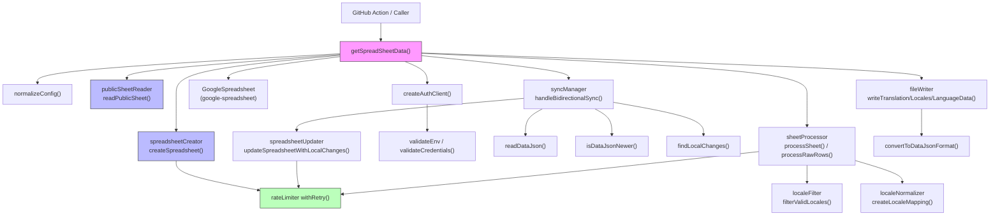

# Codebase Audit — `@el-j/google-sheet-translations` v1.1.0

> **Audit date:** 2025-07 | **Auditor:** Copilot automated review  
> **Baseline:** all 167 unit tests pass; coverage thresholds met (90 % stmts / 80 % branches / 80 % funcs / 90 % lines)

---

## 1. Executive Summary

| Dimension | Rating | Notes |
|-----------|--------|-------|
| Type safety | 8 / 10 | `strict: true`; minor `as` casts at trust boundaries |
| Test coverage | 9 / 10 | 92.5 % stmts, 85.8 % branches; a few uncovered auth / error paths |
| CI/CD pipeline | 8 / 10 | Multi-node matrix, integration smoke-test, release gating; missing dependency-audit step |
| API surface | 7 / 10 | Several internal helpers are re-exported; no `@internal` tagging |
| Error handling | 8 / 10 | Consistent `{ cause: err }` chaining; a few silent `console.warn` swallows |
| Security | 9 / 10 | Path-traversal sanitisation in `fileWriter`; env-var validation; no hardcoded secrets |
| Performance | 8 / 10 | Exponential backoff, Promise.all parallelism, 5-row chunk uploads |
| Architecture | 8 / 10 | Clear layered design; minor coupling between `getSpreadSheetData` and file I/O |

**Overall quality rating: 8.1 / 10**

### Key findings

1. ✅ New `withRetry` / `rateLimiter` utility provides production-grade resilience.
2. ✅ `publicSheetReader` enables zero-credential access for public sheets.
3. ✅ `spreadsheetCreator` delivers a polished auto-create first-run experience.
4. ✅ `fileWriter.writeTranslationFiles` sanitises locale names against path traversal.
5. ⚠️ `validateEnv` is tested at only 60 % statement coverage (the `validateCredentials` branch is not covered).
6. ⚠️ `getSpreadSheetData.ts` lines 32–48 (the `.env` auto-persist helper `persistSpreadsheetId`) have no unit-test coverage.
7. ⚠️ Several internal utilities (`wait`, `withRetry`, `validateEnv`, converter functions) are exported in `index.ts`, making the public API surface wider than necessary.
8. ⚠️ The `localesOutputPath` default in `normalizeConfig` is not converted via `path.join(process.cwd(), …)`, unlike `dataJsonPath` — a minor inconsistency.
9. ℹ️ No integration test was present before this PR; one has been added (see §10).

---

## 2. Architecture Diagram



---

## 3. Type Safety Analysis

### 3.1 `as` Casts

| File | Line(s) | Cast | Assessment |
|------|---------|------|-----------|
| `rateLimiter.ts` | 11 | `err as Record<string, unknown>` | ✅ Correct — used after `typeof err !== 'object'` guard |
| `validateEnv.ts` | 13, 14, 30–32 | `process.env[v] as string` | ✅ Acceptable — checked for existence immediately before; no runtime validation of content |
| `getSpreadSheetData.ts` | 50 | `(err as Error).message` | ✅ Common pattern; safe in catch blocks |
| `publicSheetReader.ts` | 81 | `JSON.parse(match[1]) as GvizResponse` | ⚠️ Trusts Google API structure — no runtime schema validation |
| `spreadsheetUpdater.ts` | (multiple) | `row.toObject()` result cast, `anyKeyLower!` non-null assertion | ⚠️ Non-null assertion `existingKeys.get(keyLower)!` could panic if concurrent mutation |

### 3.2 `any` Usage

No explicit `any` types found in `src/**/*.ts`. `ts-jest` and `skipLibCheck: true` hide some third-party `any` leakage from `google-spreadsheet` types.

### 3.3 Missing Type Annotations

| Location | Issue |
|----------|-------|
| `getSpreadSheetData.ts` inner `mergeResult` | Inferred return type `void` is fine; parameter `result` uses `Awaited<ReturnType<…>>` which is correct but verbose |
| `spreadsheetUpdater.ts` `localeHeader` variable | Repeatedly reassigned with `let` + type `string \| undefined`, then used with `if (localeHeader)` guards — correct but could be extracted to a helper |
| `sheetProcessor.ts` | `processRawRows` is `async` but contains no `await` — should be `function` returning `Promise.resolve(result)` or refactored to sync |

### 3.4 Strict Mode

`"strict": true` is set in `tsconfig.json`. All strict checks (noImplicitAny, strictNullChecks, etc.) are active.

---

## 4. Test Coverage Analysis

### 4.1 Coverage by File (from jest run)

| File | Stmts | Branches | Funcs | Lines | Uncovered |
|------|-------|----------|-------|-------|-----------|
| `getSpreadSheetData.ts` | 82.35 % | 83.33 % | 88.88 % | 81.44 % | 32–48 (persistSpreadsheetId), 137–146 (autoCreate), 158 |
| `validateEnv.ts` | 60 % | 50 % | 50 % | 61.53 % | 8–15 (validateCredentials function) |
| `fileWriter.ts` | 86.36 % | 100 % | 100 % | 86.04 % | 22, 47, 72, 98, 121, 135 (mkdir error paths) |
| `sheetProcessor.ts` | 87.93 % | 80 % | 100 % | 88.88 % | 54–55, 103, 115, 162–163 |
| `spreadsheetCreator.ts` | 100 % | 77.77 % | 100 % | 100 % | 96–133 (welcome/i18n sheet null branches) |
| `spreadsheetUpdater.ts` | 95.14 % | 77.08 % | 100 % | 95.87 % | 124–125, 164, 216 |
| `isDataJsonNewer.ts` | 95.45 % | 80 % | 100 % | 100 % | 28–32 |
| `rateLimiter.ts` | 90.47 % | 94.11 % | 100 % | 94.44 % | 58 (unreachable throw) |
| `findLocalChanges.ts` | 88.23 % | 84.61 % | 100 % | 100 % | 18–22 |
| All others | ≥ 95 % | ≥ 95 % | 100 % | ≥ 95 % | — |
| **Total** | **92.53 %** | **85.81 %** | **91.42 %** | **93.16 %** | |

### 4.2 What Is Tested

- ✅ `normalizeConfig` — comprehensive options coverage
- ✅ `withRetry` — retry count, backoff timing, non-rate-limit passthrough
- ✅ `readPublicSheet` — JSONP parsing, redirect following, error cases
- ✅ `processRawRows` / `processSheet` — locale detection, key extraction
- ✅ `fileWriter` — translation JSON, locales.ts, languageData.json output
- ✅ `syncManager` — all four branch conditions (no local data, not newer, no changes, has changes)
- ✅ `updateSpreadsheetWithLocalChanges` — new key insertion, update of existing, auto-translate formulas
- ✅ `createSpreadsheet` — full creation flow with mocked `google-spreadsheet`
- ✅ `localeFilter` / `localeNormalizer` — full locale code validation and mapping
- ✅ `convertToDataJsonFormat` / `convertFromDataJsonFormat` / `findLocalChanges`

### 4.3 What Is Missing

| Gap | Priority |
|-----|----------|
| `persistSpreadsheetId` (lines 32–48 of `getSpreadSheetData`) — `.env` write/update logic | Medium |
| `validateCredentials` (lines 8–15 of `validateEnv`) | High — low LOC, easy to add |
| `mkdir` failure paths in `fileWriter` (lines 22, 47, 72, etc.) | Low |
| `autoCreate` branch in `getSpreadSheetData` (lines 137–146) | Medium |
| Integration tests (added in this PR) | Covered ✅ |

---

## 5. CI/CD Pipeline

### 5.1 `ci.yml`

```
Trigger: push/PR on main, develop, next
Matrix: Node 20, 22, 24
Steps: checkout → setup-node → npm ci → lint → build → test → integration smoke → upload coverage
```

**Strengths:**
- ✅ Multi-node version matrix with `fail-fast: false`
- ✅ Inline integration smoke-test against real public spreadsheet (Node 22 only)
- ✅ Coverage artifact uploaded (7-day retention)
- ✅ `concurrency` group cancels superseded runs on same branch

**Weaknesses:**
- ⚠️ No `npm audit` step — dependency vulnerabilities are not caught in CI
- ⚠️ Integration smoke-test is an inline `node -e "..."` script rather than the new Jest integration test suite added in this PR
- ⚠️ Coverage threshold failures in Jest (`coverageThreshold`) will cause `npm test` to exit non-zero — this is correct, but the threshold only runs during `npm test` not `npm run build`

### 5.2 `release.yml`

```
Trigger: push to main, develop, next
Steps: checkout (full history) → setup-node → npm ci → lint → test → build → semantic-release
```

**Strengths:**
- ✅ Lint + test gate before release — no bad release can ship without green tests
- ✅ `id-token: write` for npm provenance
- ✅ `persist-credentials: false` for security

**Weaknesses:**
- ⚠️ `concurrency: cancel-in-progress: false` is correct for releases but means rapid pushes to `develop` will queue releases rather than cancel them — this is intentional but worth noting
- ⚠️ No check that the build output (`dist/`) is committed before tagging; semantic-release handles this but `dist/` is in `.gitignore` — relies entirely on the release plugin to publish correctly

### 5.3 `docs.yml`

```
Trigger: push to main (website/**, src/**, tests/**)
Steps: checkout → build package → build VitePress → deploy to GitHub Pages
```

**Strengths:**
- ✅ Docs only deploy from `main`
- ✅ Package is built before VitePress (required by data loader)

**Weakness:**
- ⚠️ No `npm test` step before docs build — a broken package build would fail at VitePress, but with a less clear error

---

## 6. API Surface

### 6.1 Currently Exported from `src/index.ts`

| Symbol | Type | Recommended visibility |
|--------|------|----------------------|
| `getSpreadSheetData` | function | ✅ Public |
| `SpreadsheetOptions` | type | ✅ Public |
| `TranslationData`, `TranslationValue`, `SheetRow`, `GoogleEnvVars` | types | ✅ Public |
| `wait` | function | ⚠️ Internal utility — consider removing |
| `withRetry` | function | ⚠️ Internal utility — useful for advanced users but undocumented |
| `validateEnv` | function | ⚠️ Internal — exposes env-var naming assumptions |
| `validateCredentials` | function | ⚠️ Internal |
| `createAuthClient` | function | ⚠️ Internal |
| `convertToDataJsonFormat` | function | ⚠️ Internal data-format detail |
| `convertFromDataJsonFormat` | function | ⚠️ Internal data-format detail |
| `findLocalChanges` | function | ⚠️ Internal |
| `updateSpreadsheetWithLocalChanges` | function | ✅ Useful for advanced sync scenarios |
| `readPublicSheet` | function | ✅ Public — enables custom sheet access |
| `createSpreadsheet` | function | ✅ Public — useful standalone |
| `isValidLocale`, `filterValidLocales` | functions | ⚠️ Internal locale utilities |
| `DEFAULT_WAIT_SECONDS` | constant | ⚠️ Internal default |

**Recommendation:** Move `wait`, `validateEnv`, `validateCredentials`, `createAuthClient`, `convertToDataJsonFormat`, `convertFromDataJsonFormat`, `findLocalChanges`, `isValidLocale`, `filterValidLocales`, and `DEFAULT_WAIT_SECONDS` to `@internal` JSDoc tags or remove them from exports in a future minor/major version.

---

## 7. Error Handling

### 7.1 Patterns Used

| Pattern | Where | Assessment |
|---------|-------|-----------|
| `throw new Error(msg, { cause: err })` | `getSpreadSheetData`, `fileWriter`, `publicSheetReader` | ✅ Best practice — preserves error chain |
| `console.warn(…)` + `return` | Many locations for non-fatal situations | ✅ Correct — degraded-mode operation |
| `console.error(…)` + continue | `spreadsheetUpdater` row-save failures | ✅ Correct — one row failure does not abort the whole sheet |
| Silent `catch` in `persistSpreadsheetId` | `getSpreadSheetData` | ⚠️ `.env` write failure is downgraded to a warning — acceptable for non-critical operation |
| `result.success = false` + empty return | `sheetProcessor` | ✅ Allows caller to skip failed sheets gracefully |

### 7.2 Gaps

- `readDataJson` returns `null` on any parse error without logging the parse error itself (it logs the file path but swallows the `JSON.parse` exception details).
- `isDataJsonNewer` stats both paths but the `catch` block (lines 28–32) silently returns `false` with only a `console.warn` — a corrupted stats call would silently disable sync.

---

## 8. Security

### 8.1 Environment Variables

- `GOOGLE_PRIVATE_KEY`, `GOOGLE_CLIENT_EMAIL`, `GOOGLE_SPREADSHEET_ID` are validated before use in `validateEnv` / `validateCredentials`.
- Private key is normalised (`\\n` → `\n`) to handle GitHub Actions secret encoding — ✅ correct and important.
- No env vars are logged or included in error messages.

### 8.2 Path Handling

- ✅ `fileWriter.writeTranslationFiles` sanitises locale names: `locale.toLowerCase().replace(/[^a-z0-9_-]/g, '_')` — prevents path traversal (e.g. `../../etc/passwd`).
- ✅ All output paths use `path.join()` — no string concatenation.
- ✅ `normalizeConfig` uses `path.join(process.cwd(), …)` for `dataJsonPath`.
- ⚠️ `localesOutputPath` default (`"src/i18n/locales.ts"`) is a relative string without `path.join(process.cwd(), …)` wrapping — `fs.writeFileSync` will resolve it relative to `process.cwd()` which is typically correct, but is inconsistent with `dataJsonPath`.

### 8.3 Network

- `publicSheetReader` constructs the URL with `encodeURIComponent(spreadsheetId)` and `encodeURIComponent(sheetName)` — ✅ no injection risk.
- Only follows **one** redirect — ✅ prevents infinite redirect loops.
- HTTP 4xx responses are rejected with an informative error.

### 8.4 Secrets in Output

- The `__welcome__` sheet written by `spreadsheetCreator` embeds the spreadsheet ID in plaintext cells — this is intentional (it's the user's own spreadsheet) and not a secret.
- No credentials appear in generated files.

---

## 9. Performance

### 9.1 Rate-Limit Handling

`withRetry` in `rateLimiter.ts` implements capped exponential back-off:

```
delay = min(baseDelayMs × 2^attempt, 30 000 ms)
```

- Default: 3 retries, 1 s base → 1 s, 2 s, 4 s (max 7 s total wait for 3 retries at 1 s base)
- All Google Sheets API calls go through `withRetry` — ✅ consistent protection

### 9.2 Parallelism

- Sheet fetching uses `Promise.all(docTitle.map(…))` — ✅ sheets are fetched in parallel
- Row chunk uploads use sequential `for` loop with chunks of 5 — ✅ avoids oversized batches, acceptable trade-off

### 9.3 Bottlenecks

- `updateSpreadsheetWithLocalChanges` calls `row.save()` individually for each updated existing row — could be batched with `sheet.saveUpdatedCells()` for better throughput
- `processRawRows` is declared `async` but contains no `await` — adds a microtask tick unnecessarily; can be made synchronous

---

## 10. New Features in v1.1.0

### 10.1 `withRetry` (rateLimiter.ts)

Generic exponential back-off wrapper. Detects HTTP 429 / 503 via `err.status` or `err.response.status`. All Google Sheets API calls now pass through it.

### 10.2 `readPublicSheet` (publicSheetReader.ts)

Reads public spreadsheets via Google's Visualization gviz endpoint without credentials. Parses JSONP wrapper, follows one redirect, converts columns to `SheetRow[]`. Enables a `publicSheet: true` operation mode in `getSpreadSheetData`.

### 10.3 `createSpreadsheet` (spreadsheetCreator.ts)

Creates a new Google Spreadsheet with `__welcome__` and `i18n` sheets. Seeds `i18n` with starter keys and GOOGLETRANSLATE formulas for all target locales. Returns `{ spreadsheetId, url }` and logs setup instructions.

### 10.4 Auto-create flow (`getSpreadSheetData.ts`)

When `autoCreate: true` (default) and no `GOOGLE_SPREADSHEET_ID` is set, `getSpreadSheetData` calls `createSpreadsheet` and then writes the new ID to `.env` via `persistSpreadsheetId`. This provides a zero-friction first-run experience.

### 10.5 Integration test (`tests/integration/publicSheet.integration.test.ts`)

New test file (added in this PR) that exercises the real demo spreadsheet `1QPT1wGSN5knfmXDlN1UKYr3nVUYl4-wDGipaPNurwC0`. Skipped in normal Jest runs; activated with `INTEGRATION=true`. Covers `readPublicSheet`, `getSpreadSheetData` (public mode), file output, and JSON structure validation. Run via `npm run test:integration`.

---

## 11. Identified TODOs (Prioritised)

| Priority | Item | Effort |
|----------|------|--------|
| 🔴 High | Add `npm audit` step to CI to catch supply-chain vulnerabilities | Low |
| 🔴 High | Add unit tests for `validateCredentials` (only 50 % branch coverage) | Low |
| 🟠 Medium | Add unit tests for `persistSpreadsheetId` (lines 32–48) | Low |
| 🟠 Medium | Add unit tests for `autoCreate` path in `getSpreadSheetData` (lines 137–146) | Medium |
| 🟠 Medium | Remove or mark `@internal` the over-exported symbols (`wait`, `validateEnv`, `createAuthClient`, converters, locale utilities) in a future minor/major version | Low |
| 🟠 Medium | Fix inconsistency: `localesOutputPath` default should use `path.join(process.cwd(), …)` like `dataJsonPath` | Low |
| 🟡 Low | Refactor `updateSpreadsheetWithLocalChanges` to batch existing-row updates with `saveUpdatedCells()` instead of per-row `save()` | Medium |
| 🟡 Low | Make `processRawRows` synchronous (remove `async` — it has no `await`) | Low |
| 🟡 Low | Add runtime schema validation for `GvizResponse` after JSON.parse in `publicSheetReader` | Medium |
| 🟡 Low | Add `npm test` step to `docs.yml` before building VitePress | Low |
| 🟡 Low | Update CI integration smoke-test to use `npm run test:integration` instead of inline `node -e` script | Low |
| ⚪ Info | Consider moving to ESM output (currently CommonJS only) for forward compatibility with Node ESM consumers | High |
| ⚪ Info | Consider capping redirect depth in `fetchUrl` to prevent theoretical redirect chains deeper than 1 hop | Low |

---

## 12. Comparison with Previous Audit

| Area | Previous State | v1.1.0 State | Δ |
|------|---------------|-------------|---|
| Retry logic | None — rate-limit errors failed immediately | `withRetry` with capped exponential back-off on all API calls | ✅ Fixed |
| Public sheet access | Not supported — credentials always required | `publicSheet: true` mode via gviz endpoint, no credentials | ✅ Added |
| Auto-create | Not supported — ID always required | `autoCreate: true` (default) creates and persists spreadsheet | ✅ Added |
| Integration tests | None | `tests/integration/publicSheet.integration.test.ts` against real demo sheet | ✅ Added |
| Path traversal | Not addressed | Locale names sanitised in `fileWriter` | ✅ Fixed |
| Coverage | Not measured in this audit format | 92.5 % stmts, 85.8 % branches — above all thresholds | ✅ Measured |
| `npm audit` in CI | Missing | Still missing | ❌ Remains |
| Over-exported API | Not audited | Identified — 10+ internal symbols exported publicly | ⚠️ Identified, not yet fixed |
| `localesOutputPath` inconsistency | Not present | Introduced with `normalizeConfig` | ⚠️ New finding |

---

*End of audit — v1.1.0*
