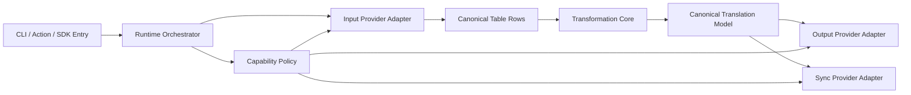

# v3 Milestone: Provider Platform Abstraction

## Goal

Transform the project from a Google-first integration into a provider-platform architecture where:

- Data input providers can pull table-like translation data from multiple hosts (Google Sheets, CryptPad exports, future Airtable/Notion/CSV HTTP).
- Output and sync providers can write/push data to different destinations.
- The transformation layer stays pure, deterministic, and provider-agnostic.

This milestone is designed for a future major release (`v3`) because it introduces new public interfaces, configuration model changes, and phased deprecations.

## Why This Is a Major Release

- Introduces new provider contracts as public API.
- Changes config shape from source-specific flags to provider-driven config.
- Moves currently implicit Google behavior behind provider modules.
- Adds capability negotiation (read/write/sync/formula support).

## Target Architecture

## Layers and Responsibilities

### 1) Provider Contracts Layer

Defines stable interfaces only:

- `TranslationInputProvider`
- `TranslationOutputProvider`
- `TranslationSyncProvider`
- `ProviderCapabilitySet`

Rules:

- No business transformation logic in providers.
- Providers return canonical rows and metadata.
- Providers declare capabilities up front.

### 2) Transformation Core Layer

Owns all data shaping and validation:

- Header normalization
- Locale detection and mapping
- Key and namespace materialization
- Merge strategy and conflict policies

Rules:

- No network access.
- No provider-specific assumptions.
- Fully unit-testable and deterministic.

### 3) Orchestration Layer

Coordinates end-to-end runs:

- Select providers from config
- Execute pull/transform/write/sync pipelines
- Enforce capability checks before operation
- Emit diagnostics and run summaries

### 4) Compatibility Layer

Adapts old options to v3 runtime during transition:

- Existing Google options map to `google-sheets` provider configs.
- Existing behavior remains available through compatibility wrapper until v3 stabilization.

## Capability Model

Each provider advertises support:

- `readTables`
- `writeTables`
- `syncBack`
- `autoTranslateFormula`
- `discoverByFolder`
- `assetSync`
- `publicReadNoAuth`

Orchestrator validates operation plans against capability requirements.

## Configuration Direction (v3)

From:

- Google-centric options and env vars.

To:

- Provider-centric runtime config:
  - `input.provider = "google-sheets" | "cryptpad-csv" | "csv-http" | ...`
  - `output.provider = "filesystem" | ...`
  - `sync.provider = "google-sheets" | "none" | ...`

## Migration Strategy

### Phase A: Internal Refactor Without API Break

- Introduce internal provider interfaces.
- Wrap existing Google behavior in provider adapters.
- Keep current public functions unchanged.

### Phase B: Dual API Window

- Add new provider-based entrypoint.
- Keep legacy entrypoint with deprecation warnings.
- Document migration mapping.

### Phase C: v3 Release Cut

- Promote provider-based entrypoint as primary API.
- Retain compatibility wrapper where low-risk.
- Publish full migration guide and upgrade checklist.

## Definition of Done for Milestone

- Google input/output/sync implemented via provider contracts.
- CryptPad MVP input provider implemented (CSV/export driven, read-only).
- Transformation core has no direct provider imports.
- Action and SDK support provider config.
- End-to-end tests cover at least:
  - Google full flow
  - CryptPad read-only flow
  - Capability enforcement errors
- Migration docs and release notes completed.

## Risks and Mitigations

- Risk: hidden Google assumptions in sync code.
  - Mitigation: extract interfaces first, move behavior behind adapter tests.
- Risk: config complexity for users.
  - Mitigation: provide presets and compatibility wrapper.
- Risk: behavior drift in locale normalization.
  - Mitigation: lock transformation snapshots before refactor.

## Suggested Milestone Metadata

- Milestone title: `v3 Provider Platform`
- Target date: 10-14 weeks after kickoff
- Labels:
  - `v3`
  - `provider-architecture`
  - `breaking-change`
  - `enhancement`
