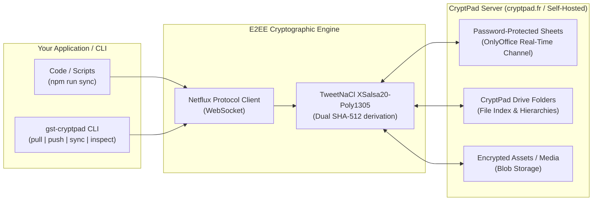

# CryptPad Full Sync: Bidirectional Push & Pull, Multi-Sheet, & Drive

`@el-j/google-sheet-translations` v3 provides native, first-class support for **CryptPad**, offering complete feature parity with Google Sheets and Google Drive while maintaining **100% end-to-end encryption (E2EE)** without requiring a browser, bot, or token.



---

## Capabilities at a Glance

| Feature | CryptPad Provider | Google Sheets Provider |
| :--- | :---: | :---: |
| **Download / Pull Translations** | ✅ (`readTables`) | ✅ (`readTables`) |
| **Upload / Push Translations** | ✅ (`writeTables`) | ✅ (`writeTables`) |
| **Two-Way / Three-Way Sync** | ✅ (`syncBack`) | ✅ (`syncBack`) |
| **Multi-Sheet Workbook Tabs** | ✅ (`Sheet1`, `common`, etc.) | ✅ (`sheetsByTitle`) |
| **Password Protection** | ✅ (Native E2EE key derivation) | ❌ (Google IAM only) |
| **Folder / Directory Discovery** | ✅ (`discoverByFolder` via Drive) | ✅ (Drive Folder Scanner) |
| **Asset / Media Sync** | ✅ (`assetSync` with SHA-256) | ✅ (Drive Image Sync) |
| **Browser Dependency** | ❌ None (Pure Netflux WebSockets) | ❌ None (Google REST APIs) |

---

## Document & Header Row Structure (100% Google Sheets Parity)

CryptPad spreadsheets use the exact same tabular convention as Google Sheets:

### Row 1: Header Definition Row
- **Column A (Cell A1):** Key column definition — standard keyword is `"var"` (or `"key"`).
- **Columns B, C, D... (Cells B1, C1, D1...):** Language locale identifiers (e.g. `"de"`, `"en"`, `"fr"`, `"es"`).

### Rows 2+: Translation Key & Content Rows
- **Column A (Cells A2, A3...):** Translation variable / key name (e.g. `saeulen.title`, `btn.submit`).
- **Columns B, C...:** Translated strings for each locale defined in row 1.

| Row | Column A (`var`) | Column B (`de`) | Column C (`en`) |
|---|---|---|---|
| **1 (Header)** | `var` | `de` | `en` |
| **2** | `hero.title` | `Signal für Demokratie` | `Signal for Democracy` |
| **3** | `nav.about` | `Über uns` | `About Us` |
| **4** | `btn.submit` | `Absenden` | `Submit` |

> [!TIP]
> Both `"var"` and `"key"` are supported interchangeably as the key header. When reading or writing, the provider recognizes either format without requiring configuration changes.

> [!TIP]
> **Headless RT-Channel Auto-Initialization (Zero Browser Required)**:
> Newly created CryptPad spreadsheets that have never been opened in OnlyOffice are automatically detected and initialized headlessly via pure Netflux protocol handshake on first write or push. No manual browser interaction or browser automation is ever required!

---

## 1. Quickstart: CLI Tooling

The package provides the dedicated `gst-cryptpad` binary.

### Inspect a CryptPad Sheet
Check sheet tabs, cell counts, and Netflux channels headlessly:

```bash
npx gst-cryptpad inspect \
  --url="https://cryptpad.fr/sheet/#/2/sheet/edit/J+EXDQVGUsSiBg5P1cun03BJ/p/" \
  --password="my-secret-password"
```

Output:
```text
Connecting headlessly to CryptPad sheet...

Document Metadata:
  App:          sheet
  Mode:         edit
  Channel ID:   89f46131586f54a4e0aef4feeb4ed932
  RT Channel:   e880999db565837bc7368946ab6351b2
  Total Cells:  42
  Sheet Tabs (2):
    - common: 15 row(s)
    - auth: 6 row(s)
```

### Pull Translations (Download)
Downloads translations into standard localization JSON files:

```bash
npx gst-cryptpad pull \
  --url="https://cryptpad.fr/sheet/#/2/sheet/edit/J+EXDQVGUsSiBg5P1cun03BJ/p/" \
  --password="my-secret-password" \
  --translations-output-dir="src/i18n"
```

### Push Translations (Upload)
Uploads local `languageData.json` translations directly into the live CryptPad sheet:

```bash
npx gst-cryptpad push \
  --url="https://cryptpad.fr/sheet/#/2/sheet/edit/J+EXDQVGUsSiBg5P1cun03BJ/p/" \
  --password="my-secret-password" \
  --data-json-path="src/lib/languageData.json" \
  --override
```

### Bidirectional Sync (Reconcile)
Runs three-way merge reconciliation between local translations and remote CryptPad sheet:

```bash
npx gst-cryptpad sync \
  --url="https://cryptpad.fr/sheet/#/2/sheet/edit/J+EXDQVGUsSiBg5P1cun03BJ/p/" \
  --password="my-secret-password" \
  --policy="local-wins"
```

---

## 2. Multi-Sheet Support (Workbook Tabs)

OnlyOffice workbooks in CryptPad support multiple tabs (`common`, `auth`, `pricing`, etc.).

### Reading Specific Tabs
In your code or configuration, specify the exact tabs to read:

```typescript
import { createCryptPadSheetInputProvider } from '@el-j/google-sheet-translations';

const provider = createCryptPadSheetInputProvider({
  url: 'https://cryptpad.fr/sheet/#/2/sheet/edit/.../p/',
  password: process.env.CRYPTPAD_PASSWORD,
});

// Reads only 'common' and 'auth' tabs
const result = await provider.readTables({
  tableNames: ['common', 'auth'],
});

for (const table of result.tables) {
  console.log(`Tab: ${table.tableName}, Rows: ${table.rows.length}`);
}
```

### Writing to Multiple Tabs
When writing translations, each top-level key in `TranslationData` matching a sheet tab is updated:

```typescript
import { createCryptPadSheetOutputProvider } from '@el-j/google-sheet-translations';

const outputProvider = createCryptPadSheetOutputProvider({
  url: 'https://cryptpad.fr/sheet/#/2/sheet/edit/.../p/',
  password: process.env.CRYPTPAD_PASSWORD,
  override: false, // preserve existing non-empty cells
});

await outputProvider.writeTranslations({
  translations: {
    en: {
      common: { 'btn.save': 'Save', 'btn.cancel': 'Cancel' },
      auth: { 'login.title': 'Welcome Back' },
    },
    de: {
      common: { 'btn.save': 'Speichern', 'btn.cancel': 'Abbrechen' },
      auth: { 'login.title': 'Willkommen zurück' },
    },
  },
  locales: ['en', 'de'],
});
```

---

## 3. CryptPad Drive Folder Discovery

Similar to scanning Google Drive folders, you can discover all spreadsheets within an encrypted CryptPad Drive folder (`/drive/#/2/drive/edit/...`):

```bash
npx gst-cryptpad drive-scan \
  --url="https://cryptpad.fr/drive/#/2/drive/edit/driveseed/p/" \
  --password="drive-password"
```

Programmatic discovery via `createCryptPadDriveCatalogProvider`:

```typescript
import { createCryptPadDriveCatalogProvider } from '@el-j/google-sheet-translations';

const catalog = createCryptPadDriveCatalogProvider({
  driveUrl: 'https://cryptpad.fr/drive/#/2/drive/edit/driveseed/p/',
  password: process.env.CRYPTPAD_DRIVE_PASSWORD,
});

const discovery = await catalog.discoverSources({ query: 'translations' });
for (const source of discovery.sources) {
  console.log(`Discovered ${source.kind}: ${source.name} (${source.metadata?.url})`);
}
```

---

## 4. Encrypted Asset Synchronization

Mirror media files (logos, illustrations, icons) hosted inside a CryptPad Drive folder directly to your local project directory (e.g. `public/assets`):

```typescript
import { createCryptPadAssetSyncProvider } from '@el-j/google-sheet-translations';

const assetProvider = createCryptPadAssetSyncProvider({
  driveUrl: 'https://cryptpad.fr/drive/#/2/drive/edit/driveseed/p/',
  password: process.env.CRYPTPAD_DRIVE_PASSWORD,
});

const result = await assetProvider.syncAssets({
  targetDirectory: './public/assets',
  deleteMissing: true, // remove local assets no longer present in CryptPad
});

console.log(`Downloaded: ${result.downloaded.length}, Updated: ${result.updated.length}`);
```

---

## 5. Runtime Configuration (`provider.config.json`)

Configure full CryptPad pipelines in your project's `provider.config.json`:

```json
{
  "$schema": "https://raw.githubusercontent.com/el-j/google-sheet-translations/develop/schemas/provider-config.schema.json",
  "input": {
    "provider": "cryptpad-sheet",
    "options": {
      "url": "https://cryptpad.fr/sheet/#/2/sheet/edit/J+EXDQVGUsSiBg5P1cun03BJ/p/",
      "password": "${CRYPTPAD_PASSWORD}",
      "tableName": "common"
    }
  },
  "output": {
    "provider": "cryptpad-sheet",
    "options": {
      "url": "https://cryptpad.fr/sheet/#/2/sheet/edit/J+EXDQVGUsSiBg5P1cun03BJ/p/",
      "password": "${CRYPTPAD_PASSWORD}",
      "override": false
    }
  },
  "sync": {
    "provider": "cryptpad-sheet",
    "options": {
      "url": "https://cryptpad.fr/sheet/#/2/sheet/edit/J+EXDQVGUsSiBg5P1cun03BJ/p/",
      "password": "${CRYPTPAD_PASSWORD}",
      "conflictPolicy": "local-wins"
    }
  },
  "assetSync": {
    "provider": "cryptpad-assets",
    "options": {
      "driveUrl": "https://cryptpad.fr/drive/#/2/drive/edit/driveseed/p/",
      "password": "${CRYPTPAD_DRIVE_PASSWORD}",
      "targetDirectory": "public/assets",
      "deleteMissing": true
    }
  }
}
```

Run the pipeline:
```bash
npx gst-run-provider --config=provider.config.json
```
